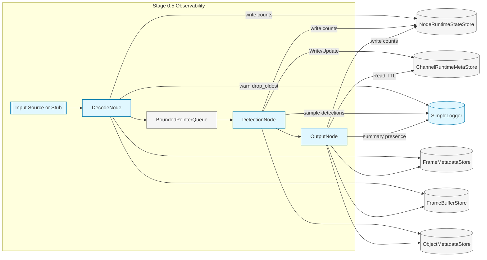

```mermaid
%% Stage 0.5 pipeline overview (mermaid)
flowchart LR
    subgraph Stage0_5[Stage 0.5 Observability]
        InputSource[[Input Source or Stub]] --> DecodeNode
        DecodeNode --> FrameQueue[BoundedPointerQueue<FrameMetadata*>]
        FrameQueue --> DetectionNode
        DetectionNode --> OutputNode
    end

    DecodeNode -->|write counts| NodeStore[(NodeRuntimeStateStore)]
    DetectionNode -->|write counts| NodeStore
    OutputNode -->|write counts| NodeStore

    DetectionNode -->|Write/Update| MetaStore[(ChannelRuntimeMetaStore)]
    OutputNode -->|Read TTL| MetaStore

    DecodeNode -->|warn drop_oldest| Logger[(SimpleLogger)]
    DetectionNode -->|sample detections| Logger
    OutputNode -->|summary presence| Logger

    DecodeNode --> FrameMetadataStore[(FrameMetadataStore)]
    DecodeNode --> FrameBufferStore[(FrameBufferStore)]
    DetectionNode --> ObjectStore[(ObjectMetadataStore)]
    OutputNode --> FrameMetadataStore
    OutputNode --> FrameBufferStore
    OutputNode --> ObjectStore

    classDef store fill:#f5f5f5,stroke:#666,stroke-width:1px;
    classDef node fill:#e0f7ff,stroke:#0077aa,stroke-width:1px;
    class DecodeNode,DetectionNode,OutputNode node;
    class FrameMetadataStore,FrameBufferStore,ObjectStore,FrameQueue,MetaStore,NodeStore store;
```