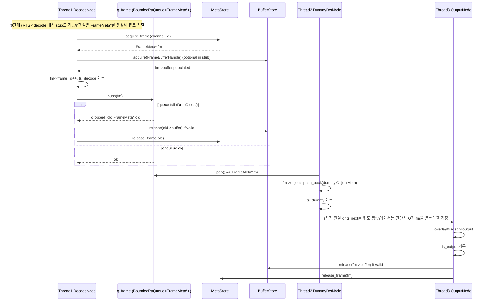

```mermaid
sequenceDiagram
    participant D as Thread1 DecodeNode
    participant Q as q_frame (BoundedPtrQueue<FrameMeta*>)
    participant M as MetaStore
    participant B as BufferStore
    participant T as Thread2 DummyDetNode
    participant O as Thread3 OutputNode

    Note over D: (0단계) RTSP decode 대신 stub도 가능\n핵심은 FrameMeta*를 생성해 큐로 전달

    D->>M: acquire_frame(channel_id)
    M-->>D: FrameMeta* fm

    D->>B: acquire(FrameBufferHandle) (optional in stub)
    B-->>D: fm->buffer populated

    D->>D: fm->frame_id++, ts_decode 기록
    D->>Q: push(fm)
    alt queue full (DropOldest)
        Q-->>D: dropped_old FrameMeta* old
        D->>B: release(old->buffer) if valid
        D->>M: release_frame(old)
    else enqueue ok
        Q-->>D: ok
    end

    T->>Q: pop() => FrameMeta* fm
    T->>T: fm->objects.push_back(dummy ObjectMeta)
    T->>T: ts_dummy 기록
    T->>O: (직접 전달 or q_next를 둬도 됨)\n여기서는 간단히 O가 fm을 받는다고 가정

    O->>O: overlay/file/jsonl output
    O->>O: ts_output 기록
    O->>B: release(fm->buffer) if valid
    O->>M: release_frame(fm)
```