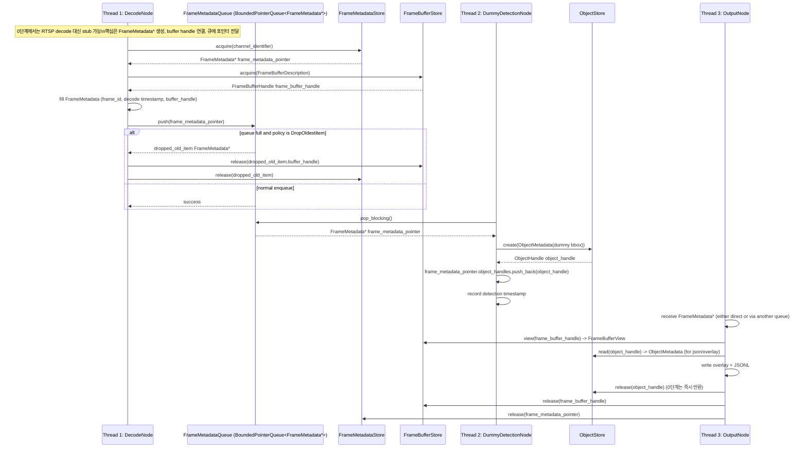

```mermaid
sequenceDiagram
    participant DecodeThread as Thread 1: DecodeNode
    participant FrameQueue as FrameMetadataQueue (BoundedPointerQueue<FrameMetadata*>)
    participant FrameMetadataStore as FrameMetadataStore
    participant FrameBufferStore as FrameBufferStore
    participant DummyDetectionThread as Thread 2: DummyDetectionNode
    participant ObjectStore as ObjectStore
    participant OutputThread as Thread 3: OutputNode

    Note over DecodeThread: 0단계에서는 RTSP decode 대신 stub 가능\n핵심은 FrameMetadata* 생성, buffer handle 연결, 큐에 포인터 전달

    DecodeThread->>FrameMetadataStore: acquire(channel_identifier)
    FrameMetadataStore-->>DecodeThread: FrameMetadata* frame_metadata_pointer

    DecodeThread->>FrameBufferStore: acquire(FrameBufferDescription)
    FrameBufferStore-->>DecodeThread: FrameBufferHandle frame_buffer_handle

    DecodeThread->>DecodeThread: fill FrameMetadata (frame_id, decode timestamp, buffer_handle)
    DecodeThread->>FrameQueue: push(frame_metadata_pointer)

    alt queue full and policy is DropOldestItem
        FrameQueue-->>DecodeThread: dropped_old_item FrameMetadata*
        DecodeThread->>FrameBufferStore: release(dropped_old_item.buffer_handle)
        DecodeThread->>FrameMetadataStore: release(dropped_old_item)
    else normal enqueue
        FrameQueue-->>DecodeThread: success
    end

    DummyDetectionThread->>FrameQueue: pop_blocking()
    FrameQueue-->>DummyDetectionThread: FrameMetadata* frame_metadata_pointer

    DummyDetectionThread->>ObjectStore: create(ObjectMetadata(dummy bbox))
    ObjectStore-->>DummyDetectionThread: ObjectHandle object_handle
    DummyDetectionThread->>DummyDetectionThread: frame_metadata_pointer.object_handles.push_back(object_handle)
    DummyDetectionThread->>DummyDetectionThread: record detection timestamp

    OutputThread->>OutputThread: receive FrameMetadata* (either direct or via another queue)
    OutputThread->>FrameBufferStore: view(frame_buffer_handle) -> FrameBufferView
    OutputThread->>ObjectStore: read(object_handle) -> ObjectMetadata (for json/overlay)
    OutputThread->>OutputThread: write overlay + JSONL
    OutputThread->>ObjectStore: release(object_handle)  (0단계는 즉시 반환)
    OutputThread->>FrameBufferStore: release(frame_buffer_handle)
    OutputThread->>FrameMetadataStore: release(frame_metadata_pointer)
```